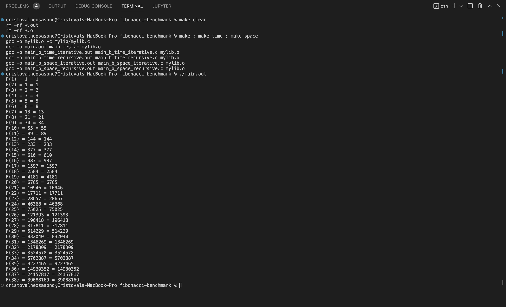
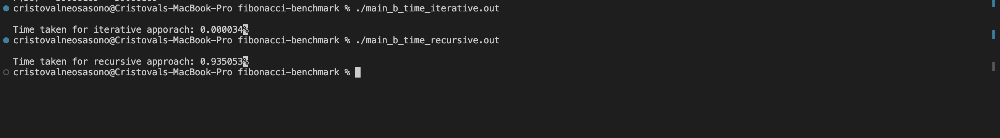
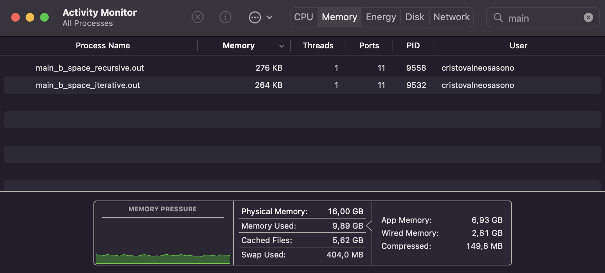

Made by: L1BC_Cristoval Neo Sasono_2602158235

# Running the Code

Input the following lines in your terminal to execute the program:
- make ; make time ; make space - To make the object files for all functions and main_test.c file.
- ./main.out - To run the implementation test of showing the iterative and recursive approach.
- ./main_b_time_iterative.out - To run the benchmark test for execution time of the iterative approach.
- ./main_b_time_recursive.out - To run the benchmark test for execution time of the recursive approach.
- ./main_b_space_iterative.out - To run the benchmark test for memory usage of the iterative approach.
- ./main_b_space_recursive.out - To run the benchmark test for memory usage of the recursive approach.
- make clear - To clear out all the object files.

# Self Test and Benchmark Results

My results from testing and benchmarking the implementations of this function.

## ./main.out 

## ./main_b_time_iterative.out and ./main_b_time_recursive.out

## ./main_b_space_iterative.out and ./main_b_space_recursive.out

